# mysql :

### request 3 :

- 使⽤ INSERT 指令新增⼀筆資料到 member 資料表中，這筆資料的 username 和 password 欄位必須是 test。接著繼續新增⾄少 4 筆隨意的資料

  - INSERT INTO `member`(`name`,`username`,`password`,`follower_count`,`time`)VALUES('Rex','test','test',130,current_time());
  - INSERT INTO `member`(`name`,`username`,`password`,`follower_count`,`time`)VALUES('Peter','lazypeter','pp123',123,current_time());
  - INSERT INTO `member`(`name`,`username`,`password`,`follower_count`,`time`)VALUES('Rita','RW','RW456',600,current_time());
  - INSERT INTO `member`(`name`,`username`,`password`,`follower_count`,`time`)VALUES('vivian','vivi','vivi789',320,current_time());
    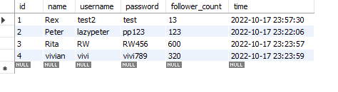

- 使⽤ SELECT 指令取得所有在 member 資料表中的會員資料。

  - SELECT \* FROM `member`;
    

- 使⽤ SELECT 指令取得所有在 member 資料表中的會員資料，並按照 time 欄位，由近到遠排序。

  - SELECT \* FROM `member` ORDER BY `time`;
    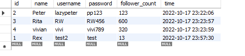

- 使⽤ SELECT 指令取得 member 資料表中第 2 ~ 4 共三筆資料，並按照 time 欄位，由近到遠排序。

  - SELECT \* FROM `member` WHERE `time` BETWEEN '2022-10-17 23:00:00' AND '2022-10-17 23:30:00';
    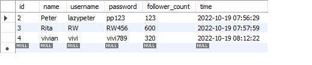

- 使⽤ SELECT 指令取得欄位 username 是 test 的會員資料。

  - SELECT \* FROM `member` WHERE `username` = 'test';
    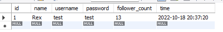

- 使⽤ SELECT 指令取得欄位 username 是 test、且欄位 password 也是 test 的資料。

  - SELECT \* FROM `member` WHERE `username` = 'test' AND `password` = 'test';
    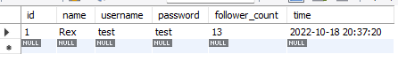

- 使⽤ UPDATE 指令更新欄位 username 是 test 的會員資料，將資料中的 name 欄位改成 test2。

  - SET SQL_SAFE_UPDATES = 0;
    UPDATE `member` SET `username` ='test2' WHERE `name` = 'Rex';
    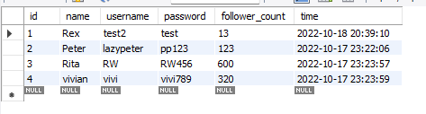

### request 4 :

- 取得 member 資料表中，總共有幾筆資料 ( 幾位會員 )。
  -SELECT COUNT(`name`) FROM `member` ;
  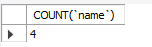

- 取得 member 資料表中，所有會員 follower_count 欄位的總和。
  -SELECT sum(`follower_count`) FROM `member`;
  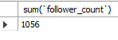

- 取得 member 資料表中，所有會員 follower_count 欄位的平均數。
  -SELECT avg(`follower_count`) FROM `member`;
  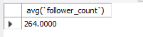

### request 5 (optional):

- 使⽤ SELECT 搭配 JOIN 語法，取得所有留⾔，結果須包含留⾔者會員的姓名。
  -SELECT \* FROM `member` INNER JOIN `message` ON `member`.id = `message`.`member_id`;
  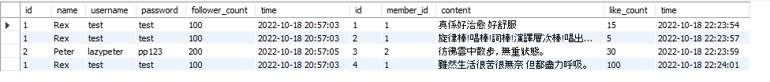

- 使⽤ SELECT 搭配 JOIN 語法，取得 member 資料表中欄位 username 是 test 的所有留⾔，資料中須包含留⾔者會員的姓名。
  -SELECT \* FROM `member` INNER JOIN `message` ON `member`.id = `message`.`member_id` WHERE `username` = 'test' ;
  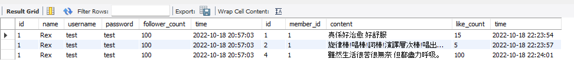

- 使⽤ SELECT、SQL Aggregate Functions 搭配 JOIN 語法，取得 member 資料表中欄位 username 是 test 的所有留⾔平均按讚數。
  - SELECT `member`.`username`,floor(AVG(`like_count`)) FROM `member` INNER JOIN `message` ON `member`.id = `message`.`member_id` WHERE `username` = 'test' ;
    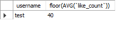
